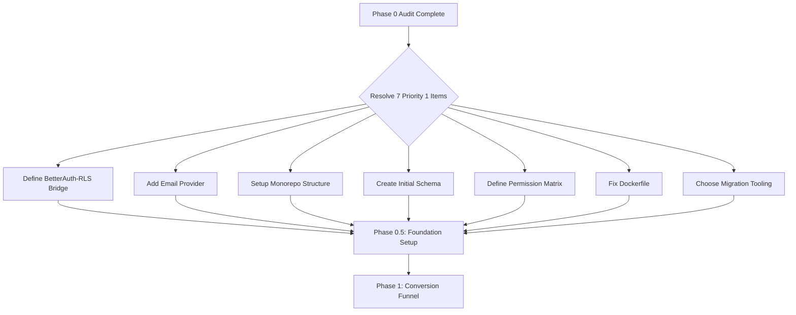

# Phase 0: Architecture Swarm Audit Report

**Cash Offer Conversion School Platform**
**Date:** 2026-03-08 | **Status:** Pre-Development Architecture Review

---

## Executive Summary

This audit evaluates the proposed architecture for the Cash Offer Conversion School platform — a multi-tenant SaaS that trains operators to run cash offer lead generation businesses through 5 phases (Conversion Funnel → Academy → Engagement → Conversion Intelligence → Coaching Platform).

The spec defines the **what**; this audit stress-tests the **how** — uncovering risks, gaps, and missing decisions before a single line of production code is written.

> [!CAUTION]
> **13 Critical/High findings** and **19 Medium findings** have been identified across all audit domains. These must be resolved before Phase 1 coding begins.

---

## Agent Roster & Audit Domains

| Agent | Domain | Findings |
|---|---|---|
| @architecture-reviewer | System design, modularity, integration patterns | 6 |
| @frontend-specialist | Next.js, SSR, UI component strategy | 4 |
| @backend-specialist | API design, service layer, BetterAuth | 5 |
| @seo-specialist | SEO architecture, Core Web Vitals | 3 |
| @security-auditor | Auth, RLS, secrets, attack surface | 6 |
| @performance-optimizer | Load targets, caching, edge strategy | 4 |
| @devops-engineer | Docker, Dokploy, CI/CD, env management | 5 |
| @test-engineer | Testing strategy, coverage model | 3 |
| @qa-automation-engineer | E2E, regression frameworks | 2 |
| @ai-systems-engineer | BlockNote AI, analytics AI | 3 |
| @database-analyst | Schema, multi-tenancy, indexes, migrations | 5 |
| **@CLAUD-TISTIC** | Adversarial cross-agent review | 8 |

---

## Deliverable 1: Architecture Risks

### RISK-01 — BetterAuth + Supabase RLS Session Gap `CRITICAL`

**Agent:** @architecture-reviewer, @security-auditor

BetterAuth manages sessions *outside* Supabase Auth. But Supabase RLS policies typically rely on `auth.uid()` from Supabase's JWT. This creates a fundamental conflict:

- BetterAuth issues its own sessions/tokens
- Supabase RLS has no native awareness of BetterAuth sessions
- Direct Supabase client access from the frontend **cannot enforce RLS** unless a custom JWT is bridged

**Impact:** Complete bypass of row-level security from any client-side Supabase query.

**Recommendation:**
1. All database access MUST go through a **server-side API layer** (Next.js Route Handlers / Server Actions) — never direct Supabase client queries from the browser
2. Use `SUPABASE_SERVICE_ROLE_KEY` server-side with manual `organization_id` filtering
3. Or implement a **custom JWT bridge** that mints Supabase-compatible JWTs from BetterAuth sessions with `organization_id` claims

---

### RISK-02 — Undefined Monorepo Structure `HIGH`

**Agent:** @architecture-reviewer, @frontend-specialist

The spec mentions `packages/services` for business logic and `apps/web` for UI, implying a monorepo. But no package manager workspace config (Turborepo, Nx, pnpm workspaces) is defined.

**Impact:** Without clear boundaries, business logic will leak into UI components, and shared code will be duplicated.

**Recommendation:**
```
cash-offer-conversion-school/
├── apps/
│   └── web/                    # Next.js application
├── packages/
│   ├── auth/                   # BetterAuth config + middleware
│   ├── database/               # Supabase client, schema types, migrations
│   ├── services/               # Business logic (courses, enrollment, analytics)
│   └── ui/                     # Shared UI components (shadcn/ui wrapper)
├── turbo.json
├── package.json
└── docker/
    └── Dockerfile
```

---

### RISK-03 — RBAC + ABAC Hybrid Undefined `HIGH`

**Agent:** @backend-specialist, @security-auditor

The spec mandates "RBAC + ABAC hybrid" permissions but provides zero detail on:
- What roles exist (admin, instructor, student, auditor?)
- What attributes drive ABAC decisions (subscription tier, course progress, organization plan?)
- Where permissions are enforced (middleware, RLS, API layer, UI?)

**Impact:** Without a concrete model, permissions will be inconsistently implemented across phases.

**Recommendation:**
Define a permission matrix before Phase 1:

| Role | Landing | Dashboard | Courses | Admin | Coaching |
|---|---|---|---|---|---|
| `owner` | ✅ | ✅ | ✅ | ✅ | ✅ |
| `admin` | ✅ | ✅ | ✅ | ✅ | ❌ |
| `instructor` | ✅ | ✅ | ✅ (own) | ❌ | ✅ |
| `student` | ✅ | ✅ | ✅ (enrolled) | ❌ | ❌ |
| `prospect` | ✅ | ❌ | ❌ | ❌ | ❌ |

BetterAuth's Organization plugin supports custom roles and `has()` permission checks — use this.

---

### RISK-04 — No API Strategy Defined `HIGH`

**Agent:** @backend-specialist, @architecture-reviewer

The system integrates with PostHog, GrowthBook, Nango, Jitsi, BigBlueButton — but there's no defined API strategy:
- Are these server-side only or also exposed to the client?
- Is there an API gateway layer?
- How are third-party failures handled?

**Impact:** Inconsistent integration patterns and no circuit-breaking for external service failures.

**Recommendation:**
- Define a **service integration layer** in `packages/services/integrations/`
- Implement circuit breaker patterns for all third-party calls
- All external API calls server-side only — never expose third-party keys to client

---

### RISK-05 — No Data Model for Course Content `MEDIUM`

**Agent:** @database-analyst, @ai-systems-engineer

BlockNote + blocknote-ai is specified for content, but there's no schema for:
- How course content (modules, episodes, downloads) is stored
- Whether BlockNote documents are stored as JSON or as structured records
- How progress tracking maps to content items
- How quiz blocks will integrate (noted as "future")

**Impact:** Schema decisions made late will require destructive migrations.

**Recommendation:**
Define core content schema now, even if Phase 2:
```sql
courses → modules → episodes → content_blocks (JSON)
                              → downloads (files)
                              → progress_records (per user)
```

---

### RISK-06 — Missing State Management Strategy `MEDIUM`

**Agent:** @frontend-specialist

No specification for client-side state management:
- Server state: React Query / SWR / Next.js Server Components?
- Client state: Zustand / Jotai / React Context?
- Real-time: Supabase Realtime channels?

**Impact:** Inconsistent data fetching patterns across phases.

**Recommendation:** Standardize on Next.js Server Components + React Query for client-side cache invalidation + Supabase Realtime for live features (discussions, coaching).

---

## Deliverable 2: Schema Issues

### SCHEMA-01 — Multi-Tenant Key Strategy Undefined `CRITICAL`

**Agent:** @database-analyst

Every table needs `organization_id` — but critical questions are unanswered:
- UUID v4 or v7 for primary keys?
- Is `organization_id` always a foreign key or derived from auth context?
- Are cross-tenant queries ever needed (platform admin reporting)?
- How is `organization_id` populated — application code or database trigger?

**Recommendation:**
- Use UUID v7 (time-sortable) for all primary keys
- `organization_id` as FK to `organizations` table, set via application layer
- Create a `set_tenant(org_id)` function for RLS context
- Platform admin queries use service role key, bypassing RLS

---

### SCHEMA-02 — BetterAuth Tables Not Planned `HIGH`

**Agent:** @database-analyst, @backend-specialist

BetterAuth creates its own tables (`user`, `session`, `account`, `verification`). These need to coexist with your schema. Key questions:
- Does BetterAuth's `user` table get `organization_id`?
- How do BetterAuth sessions carry tenant context?
- Is BetterAuth managing its own migrations or are you?

**Recommendation:**
- Use BetterAuth's Organization plugin — it creates `organization`, `member`, `invitation` tables automatically
- Extend the `user` table with a linking table to your domain models
- Let BetterAuth manage its own migration lifecycle; your migrations reference its tables

---

### SCHEMA-03 — No Audit Log Schema `MEDIUM`

**Agent:** @database-analyst, @security-auditor

The spec requires "audit logs" but no schema is defined. Audit logs need:
- Who (user_id), What (action), When (timestamp), Where (resource), How (IP, user agent)
- Immutable append-only design
- Retention policy

**Recommendation:**
```sql
CREATE TABLE audit_logs (
  id UUID PRIMARY KEY DEFAULT gen_random_uuid(),
  organization_id UUID NOT NULL,
  user_id UUID,
  action TEXT NOT NULL,
  resource_type TEXT NOT NULL,
  resource_id UUID,
  metadata JSONB DEFAULT '{}',
  ip_address INET,
  created_at TIMESTAMPTZ DEFAULT now()
);
-- NO UPDATE/DELETE policies — append only
```

---

### SCHEMA-04 — Missing Index Strategy `MEDIUM`

**Agent:** @database-analyst, @performance-optimizer

No indexing strategy defined. With multi-tenancy, every query will filter on `organization_id`. Without composite indexes, query performance will degrade as data grows.

**Recommendation:**
- Every table: composite index on `(organization_id, created_at DESC)`
- Course queries: composite index on `(organization_id, course_id, user_id)`
- Full-text search: `pg_trgm` or `tsvector` for course/episode search

---

### SCHEMA-05 — Migration Tooling Not Specified `MEDIUM`

**Agent:** @database-analyst, @devops-engineer

Rules say migrations must be incremental/reversible/non-destructive. But there's no migration tool specified:
- Drizzle ORM migrations?
- Prisma migrations?
- Raw SQL with Supabase CLI?
- BetterAuth's built-in migration system?

**Recommendation:** Use Drizzle ORM — it's lightweight, generates SQL migrations, and works cleanly with Supabase Postgres. BetterAuth officially supports Drizzle as an adapter.

---

## Deliverable 3: Security Concerns

### SEC-01 — Service Role Key Exposure Risk `CRITICAL`

**Agent:** @security-auditor

The environment setup lists `SUPABASE_SERVICE_ROLE_KEY` as an env var. This key bypasses ALL RLS. If it leaks to the client bundle via a `NEXT_PUBLIC_` prefix error or misconfigured server component, the entire database is exposed.

**Recommendation:**
- **Never** prefix with `NEXT_PUBLIC_`
- Only use in Server Actions, Route Handlers, or server-side code
- Add build-time validation that rejects `SUPABASE_SERVICE_ROLE_KEY` in client bundles
- Consider: since BetterAuth handles auth, you may not need `NEXT_PUBLIC_SUPABASE_ANON_KEY` at all — all DB access can be server-side

---

### SEC-02 — No CSRF Protection Strategy `HIGH`

**Agent:** @security-auditor

BetterAuth handles sessions, but the spec doesn't address CSRF. Next.js Server Actions have built-in CSRF protection, but custom API routes do not.

**Recommendation:**
- Use Server Actions for all mutations (built-in CSRF tokens)
- If using API routes, implement `Origin`/`Referer` header validation
- BetterAuth's `csrf` option should be enabled

---

### SEC-03 — No Rate Limiting Architecture `HIGH`

**Agent:** @security-auditor, @performance-optimizer

No rate limiting defined for:
- Login attempts (brute force)
- Registration (spam accounts)
- API endpoints (DDoS)
- File upload (storage abuse)

**Recommendation:**
- Use `@upstash/ratelimit` with Redis for distributed rate limiting
- Or implement token bucket at the Dokploy/reverse proxy layer
- BetterAuth supports rate limiting plugins — enable them

---

### SEC-04 — Supabase Storage Access Control `MEDIUM`

**Agent:** @security-auditor

Supabase Storage is listed for file storage, but access policies aren't defined. Without BetterAuth integration, storage bucket policies can't verify user identity.

**Recommendation:**
- All file uploads/downloads go through server-side API routes
- Generate signed URLs server-side with short expiry
- Never expose storage bucket access directly to the client

---

### SEC-05 — No Content Security Policy `MEDIUM`

**Agent:** @security-auditor, @frontend-specialist

No CSP headers defined. With BlockNote (rich text editor), Jitsi embeds, and PostHog scripts, a permissive CSP creates XSS risk.

**Recommendation:**
Define CSP in `next.config.js`:
```
default-src 'self';
script-src 'self' posthog.com;
frame-src jitsi-domain bbb-domain;
style-src 'self' 'unsafe-inline';
```

---

### SEC-06 — Secrets Management for Dokploy `MEDIUM`

**Agent:** @devops-engineer, @security-auditor

No secrets management strategy. Environment variables are the only secrets mechanism mentioned. Dokploy supports environment injection, but:
- How are secrets rotated?
- Where are production secrets stored?
- Who has access?

**Recommendation:**
- Use Dokploy's environment variable management with encryption at rest
- Document secret rotation procedures
- Implement a `BETTER_AUTH_SECRET` rotation strategy (BetterAuth supports key arrays for rolling rotation)

---

## Deliverable 4: Performance Bottlenecks

### PERF-01 — <1.5s Load Target Lacks Strategy `HIGH`

**Agent:** @performance-optimizer, @frontend-specialist

The spec targets <1.5s page loads with "SSR + Edge caching" but doesn't specify:
- Which pages are SSR vs SSG vs ISR?
- What's the caching layer? (Vercel Edge? Cloudflare? Dokploy has no edge CDN)
- How does SSR work with BetterAuth sessions?

**Impact:** Dokploy self-hosting has **no built-in edge CDN**. The 1.5s target requires explicit caching infrastructure.

**Recommendation:**
- Landing page: **SSG** (static, no auth needed)
- Dashboard/courses: **SSR** with stale-while-revalidate caching
- Add **Cloudflare** in front of Dokploy for edge caching + global CDN
- Configure `Cache-Control` headers per route type

---

### PERF-02 — No Database Connection Pooling Strategy `HIGH`

**Agent:** @performance-optimizer, @database-analyst

Next.js creates new database connections per serverless-like invocation. Without pooling, you'll hit Postgres connection limits fast.

**Recommendation:**
- Use Supabase's built-in **PgBouncer** (`port 6543` for pooled connections)
- Connection string should use the pooler URL, not direct connection
- Configure `SUPABASE_DB_URL` to use `?pgbouncer=true&connection_limit=10`

---

### PERF-03 — BlockNote Document Size Unbounded `MEDIUM`

**Agent:** @performance-optimizer, @ai-systems-engineer

BlockNote stores rich documents as JSON. Without size limits:
- Large course modules could produce 1MB+ JSON documents
- Loading these client-side will spike TTFB and parse time

**Recommendation:**
- Set a max document size (500KB warning, 1MB hard limit)
- Implement lazy loading for course content (load episode-by-episode, not full module)
- Consider server-side rendering of BlockNote content for SEO

---

### PERF-04 — Analytics Script Loading Impact `MEDIUM`

**Agent:** @performance-optimizer, @seo-specialist

PostHog + GrowthBook + OpenTelemetry = 3 analytics scripts loading on every page. This directly impacts Core Web Vitals.

**Recommendation:**
- Load PostHog and GrowthBook with `next/script` strategy `afterInteractive`
- Use server-side OpenTelemetry (Node.js SDK, not browser)
- Implement consent-based loading for GDPR compliance
- Total third-party script budget: <100KB gzipped

---

## Deliverable 5: Integration Gaps

### INT-01 — Nango Integration Undefined `HIGH`

**Agent:** @backend-specialist, @architecture-reviewer

Nango is listed for CRM integrations in Phase 4 but there's no mention of:
- Which CRMs are targeted
- Whether Nango is self-hosted or cloud
- OAuth flow architecture
- Data sync strategy (webhooks vs polling)

**Recommendation:**
If CRM integration is Phase 4, Nango architecture can be deferred. But define the integration pattern now:
- Nango Cloud for simplicity (managed OAuth token refresh)
- Webhook-based sync to avoid polling overhead
- Store integration state in `integrations` and `integration_syncs` tables

---

### INT-02 — Live Session Architecture Unspecified `HIGH`

**Agent:** @backend-specialist, @devops-engineer

Jitsi and BigBlueButton are listed for Phase 5 coaching. Both require:
- Self-hosted servers or cloud subscriptions
- WebRTC infrastructure (TURN/STUN servers)
- Significant bandwidth and compute resources

**Impact:** Adding video conferencing infrastructure mid-project is a major scope expansion.

**Recommendation:**
- Decide NOW: self-host vs managed service
- Budget for WebRTC infrastructure (TURN servers cost $50-200/mo minimum)
- Consider starting with Jitsi Meet external links before building embedded experience
- Alternative: Use Whereby or Daily.co APIs for simpler integration

---

### INT-03 — PostHog ↔ GrowthBook Data Flow `MEDIUM`

**Agent:** @ai-systems-engineer, @performance-optimizer

Both PostHog (analytics) and GrowthBook (feature flags/experiments) are listed, but their integration path isn't defined:
- Does GrowthBook consume PostHog events for experiment metrics?
- Or does each tool operate independently?

**Recommendation:**
- Use PostHog as the event source, GrowthBook as the experiment layer
- GrowthBook can use PostHog as a data source for experiment metrics
- Define the event taxonomy now (before Phase 1) — e.g., `funnel.step_completed`, `course.episode_viewed`

---

## Deliverable 6: Missing Components

### MISSING-01 — No Email/Notification System `CRITICAL`

**Agent:** @backend-specialist, @architecture-reviewer

The platform needs email for:
- Registration confirmation
- Password reset (BetterAuth requires an email provider)
- Course notifications
- Coaching invitations
- Phase 5 explicitly lists "Notifications"

But **no email provider is specified** anywhere in the docs.

**Recommendation:**
- Add Resend or Postmark as the transactional email provider
- BetterAuth requires email configuration for password reset and verification flows
- Define this BEFORE Phase 1 — registration flow needs it

---

### MISSING-02 — No Error Tracking / Monitoring `HIGH`

**Agent:** @devops-engineer, @performance-optimizer

OpenTelemetry is listed for analytics but not error tracking. There's no:
- Error reporting service (Sentry, BetterStack)
- Uptime monitoring
- Alerting strategy

**Recommendation:**
- Add Sentry for error tracking (free tier sufficient for launch)
- Use OpenTelemetry to pipe traces to a backend (Grafana Cloud free tier or Sentry)
- Dokploy provides basic health checks — configure them

---

### MISSING-03 — No File Upload Strategy `HIGH`

**Agent:** @backend-specialist, @security-auditor

Supabase Storage is mentioned but:
- What file types are allowed?
- What size limits apply?
- How are files scanned for malware?
- How are files associated with course content?

**Recommendation:**
- Define allowed file types (PDF, DOCX, MP4, images)
- Set upload limits (50MB for videos, 10MB for documents)
- Implement server-side file type validation (don't trust MIME headers)
- Serve files through signed URLs with short TTL

---

### MISSING-04 — No CI/CD Pipeline `HIGH`

**Agent:** @devops-engineer, @test-engineer

The deployment target is Dokploy with Docker, but there's no CI/CD pipeline:
- No GitHub Actions / workflows defined
- No automated testing before deploy
- No staging environment
- No rollback strategy

**Recommendation:**
```yaml
# Minimum CI/CD pipeline
on push to main:
  1. Lint + type check
  2. Run unit + integration tests
  3. Build Docker image
  4. Push to registry
  5. Deploy to Dokploy staging
  6. Run E2E tests against staging
  7. Manual approval → production deploy
```

---

### MISSING-05 — No Backup Strategy `MEDIUM`

**Agent:** @devops-engineer, @database-analyst

Supabase provides daily backups on paid plans, but:
- What's the RTO/RPO target?
- Are point-in-time recovery (PITR) capabilities needed?
- Are Supabase Storage files backed up?

**Recommendation:**
- Enable Supabase PITR for critical data
- Define RTO: 1 hour, RPO: 15 minutes as baseline targets
- Storage backups: sync to secondary S3-compatible storage

---

### MISSING-06 — No Observability Dashboard `MEDIUM`

**Agent:** @devops-engineer, @performance-optimizer

OpenTelemetry is listed but where do traces/metrics go? No observability backend is defined.

**Recommendation:**
- Grafana Cloud (free tier: 50GB logs, 10K metrics)
- Or BetterStack for logs + uptime (simpler setup)
- Define key SLIs: p95 latency, error rate, auth success rate

---

## Deliverable 7: Recommendations Before Coding

### Priority 1 — Must Resolve Before Phase 1

| # | Action | Owner | Complexity |
|---|---|---|---|
| 1 | **Define BetterAuth ↔ Supabase RLS bridge strategy** — decide server-only DB access vs custom JWT | @architecture-reviewer | High |
| 2 | **Add email provider** (Resend recommended) and configure BetterAuth email flows | @backend-specialist | Medium |
| 3 | **Define monorepo structure** with Turborepo + pnpm workspaces | @architecture-reviewer | Medium |
| 4 | **Create initial schema** — organizations, users (BetterAuth), qualification_forms, audit_logs | @database-analyst | High |
| 5 | **Define role/permission matrix** — concrete roles and resource-level permissions | @security-auditor | Medium |
| 6 | **Fix Dockerfile** — current Dockerfile is insecure (runs as root, copies everything, no multi-stage) | @devops-engineer | Low |
| 7 | **Choose migration tooling** — recommend Drizzle ORM with Supabase Postgres | @database-analyst | Low |

### Priority 2 — Must Resolve Before Phase 2

| # | Action | Owner | Complexity |
|---|---|---|---|
| 8 | Define course content schema (BlockNote JSON storage model) | @database-analyst | Medium |
| 9 | Set up CI/CD pipeline (GitHub Actions → Dokploy) | @devops-engineer | Medium |
| 10 | Add error tracking (Sentry) | @devops-engineer | Low |
| 11 | Define edge caching strategy (Cloudflare in front of Dokploy) | @performance-optimizer | Medium |
| 12 | Define analytics event taxonomy | @ai-systems-engineer | Low |

### Priority 3 — Must Resolve Before Phase 4+

| # | Action | Owner | Complexity |
|---|---|---|---|
| 13 | Evaluate Nango hosting model (cloud vs self-hosted) | @backend-specialist | Low |
| 14 | Decide Jitsi/BBB deployment (self-host vs SaaS alternative) | @devops-engineer | High |
| 15 | Design notification system (in-app + email + push) | @backend-specialist | Medium |

---

## CLAUD-TISTIC Adversarial Review

> *CLAUD-TISTIC challenges assumptions and cross-checks all agent conclusions.*

### Challenge 1: "BetterAuth is the right choice"

**Status:** ⚠️ CONDITIONALLY VALID

BetterAuth is a solid choice but introduces friction that Supabase Auth would avoid:
- Supabase Auth has native RLS integration via `auth.uid()`
- BetterAuth requires building the RLS bridge manually
- BetterAuth's Organization plugin is relatively new — verify it supports your full RBAC needs

**Verdict:** BetterAuth is valid IF the team commits to server-only database access. If client-side Supabase queries are needed, reconsider.

### Challenge 2: "Supabase as database-only is clean separation"

**Status:** ⚠️ PARTIALLY TRUE

Using Supabase only for Postgres + Storage is architecturally clean, but you're *paying for* Auth, Edge Functions, and Realtime that you won't use. Also:
- Supabase RLS without Supabase Auth requires custom JWT handling
- Supabase Storage policies rely on `auth.uid()` — same gap as RLS

**Verdict:** Valid architecture, but ensure the team understands the RLS/Storage gap is systemic, not just a "nice to have" fix.

### Challenge 3: "Dokploy for deployment is sufficient"

**Status:** ⚠️ RISK

Dokploy is lightweight and self-hosted, but:
- No built-in CDN or edge caching — the <1.5s target is unreachable without Cloudflare
- No auto-scaling — if coaching webinars spike traffic, manual scaling is needed
- No blue-green deployments — rollbacks require manual Docker image switching

**Verdict:** Dokploy works for MVP. Must add Cloudflare for CDN and plan scaling strategy before coaching phase.

### Challenge 4: "Five phases is a reasonable scope"

**Status:** ❌ OVER-SCOPED for initial launch

The spec describes a platform that competes with Teachable + Calendly + Circle + HubSpot combined. Phase 5 alone (events, webinars, memberships, notifications, quizzes + Jitsi/BBB integration) is a product in itself.

**Verdict:** Focus on Phases 1-2 for MVP. Phases 3-5 should be validated with real users before committing engineering resources. Consider using third-party tools (Cal.com for coaching, Circle for community) initially.

### Challenge 5: "The Dockerfile is production-ready"

**Status:** ❌ FAILS BASIC SECURITY

The current Dockerfile:
```dockerfile
FROM node:20-alpine
WORKDIR /app
COPY . .
RUN npm install
RUN npm run build
EXPOSE 3000
CMD ["npm","start"]
```

Issues:
- Runs as root
- Copies entire repo (including `.git`, `.env` files)
- No `.dockerignore`
- No multi-stage build (image contains dev dependencies)
- `npm install` without `--production` or `ci`

### Challenge 6: "Three analytics tools is appropriate"

**Status:** ⚠️ OVER-ENGINEERED for Phase 1

PostHog + GrowthBook + OpenTelemetry before the first user signs up? PostHog alone provides analytics + feature flags + session replay + experiments.

**Verdict:** Start with PostHog only. Add GrowthBook when running A/B tests at scale. Add OpenTelemetry when you need distributed tracing.

### Challenge 7: "RBAC + ABAC hybrid is needed"

**Status:** ⚠️ PREMATURE

ABAC (attribute-based access control) is complex. With <5 roles and <10 resources in Phase 1, pure RBAC via BetterAuth's Organization plugin is sufficient.

**Verdict:** Start with RBAC. Evolve to ABAC only when you have concrete requirements that pure RBAC can't handle (e.g., "users can only access courses in their subscription tier").

### Challenge 8: "The spec is detailed enough to start building"

**Status:** ❌ NOT YET

The spec defines features well but is missing:
- Email provider (blocks registration)
- Concrete roles and permissions (blocks auth implementation)
- Database schema (blocks everything)
- API strategy (blocks service layer)
- CI/CD pipeline (blocks safe deployment)

**Verdict:** The 7 Priority 1 items in this audit must be resolved and documented before Phase 1 begins.

---

## Recommended Next Steps



> [!IMPORTANT]
> This audit recommends inserting a **Phase 0.5: Foundation Setup** between this audit and Phase 1. Phase 0.5 should produce: the monorepo scaffold, BetterAuth configuration, initial database schema, Dockerfile, CI/CD pipeline, and the first deployment to Dokploy staging. Only then should Phase 1 feature work begin.
